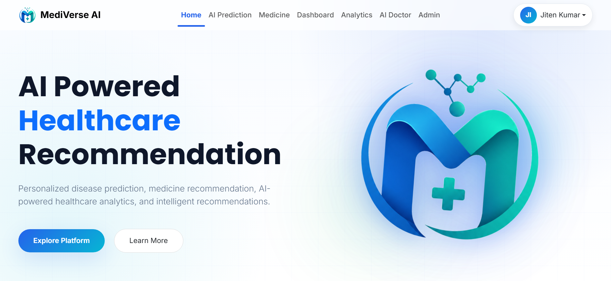
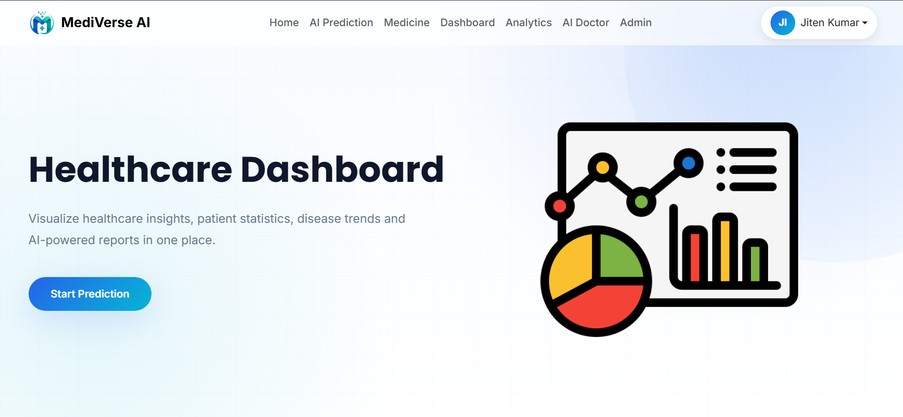
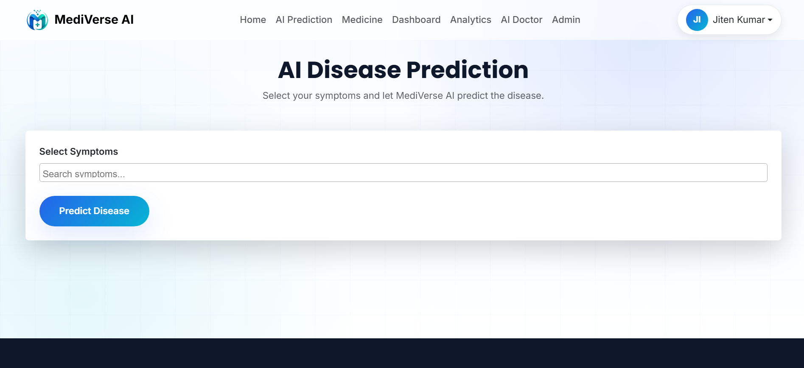
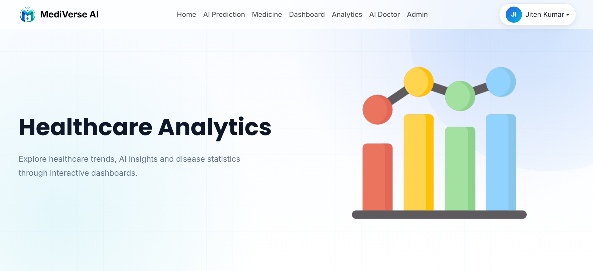
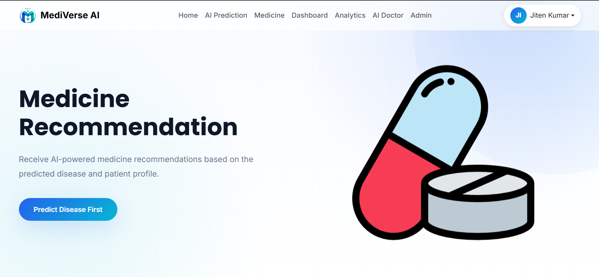
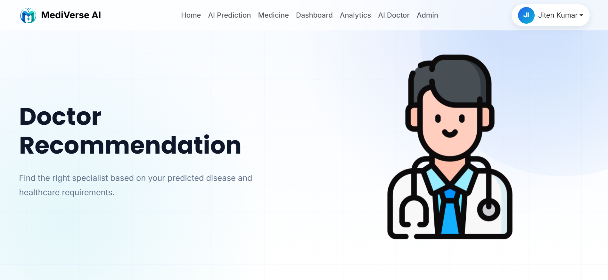
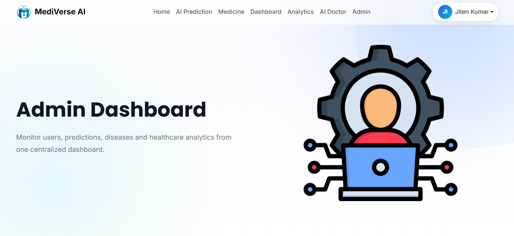
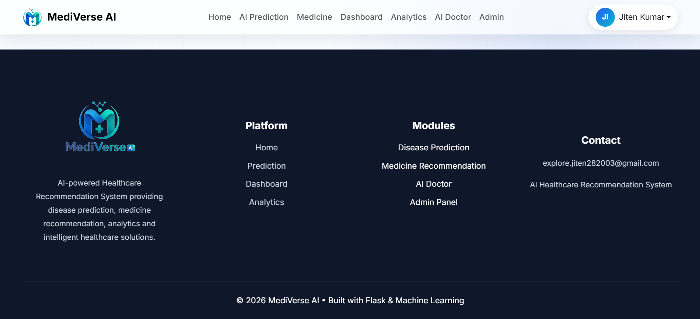

# 🩺 MediVerse AI – Healthcare Recommendation System


An AI-powered Healthcare Recommendation System built with **Flask**, **Machine Learning**, and **Bootstrap** that predicts diseases based on user-selected symptoms and provides medicine recommendations, doctor suggestions, healthcare analytics, and administrative insights through an interactive dashboard.

---

# 🌐 Live Demo

**Application:**  
https://mediverse-ai.onrender.com

---

# 🚀 Features

## 👤 User Authentication

- User Registration
- Secure Login
- Password Hashing using Flask-Bcrypt
- Session Management with Flask-Login

---

## 🤖 AI Disease Prediction

- Predict diseases using a trained Machine Learning model
- Confidence score for every prediction
- Symptom-based disease diagnosis
- Stores prediction history for every user

---

## 💊 Medicine Recommendation

- AI-based medicine recommendation
- Disease-specific suggestions
- Recommendations generated immediately after prediction

---

## 👨‍⚕️ Doctor Recommendation

Provides specialist recommendations including:

- Cardiologist
- Neurologist
- Dermatologist
- Orthopedic
- Pediatrician
- Psychiatrist
- ENT Specialist
- Pulmonologist
- Gastroenterologist
- Gynecologist
- Endocrinologist
- Ophthalmologist

> **Future Update:** Doctor contact details, hospital information, Google Maps integration, and appointment booking links will be added.

---

## 📊 Healthcare Analytics

Interactive analytics dashboard featuring:

- Total Predictions
- Average Confidence
- Most Predicted Disease
- Prediction History
- Bar Chart
- Pie Chart
- Line Chart

---

## 📈 Dashboard

User Dashboard includes:

- Latest Prediction
- Disease Statistics
- Interactive Charts
- Prediction Summary

---

## 🛡️ Admin Dashboard

Accessible only to administrators.

Features include:

- Total Users
- Total Diseases
- Total Predictions
- Recent Prediction Activity
- Overall Healthcare Statistics

> Regular users cannot access the Admin Dashboard.

---

## 📄 Export Reports

Users can export their prediction history as:

- 📄 PDF Report
- 📊 Excel Report (.xlsx)

---

# 🧠 Machine Learning Model

The disease prediction model was trained using **Scikit-Learn** on a symptom-based healthcare dataset.

The pipeline includes:

- Data Preprocessing
- Label Encoding
- Disease Classification
- Confidence Score Prediction

### Libraries Used

- Scikit-Learn
- NumPy
- Pandas
- Joblib

---

# 🛠 Tech Stack

## Backend

- Flask
- Flask-SQLAlchemy
- Flask-Login
- Flask-Bcrypt
- WTForms

## Frontend

- HTML5
- CSS3
- Bootstrap 5
- JavaScript
- Chart.js
- Jinja2

## Machine Learning

- Scikit-Learn
- Pandas
- NumPy

## Database

- SQLite

## Report Generation

- ReportLab (PDF)
- OpenPyXL (Excel)

---

# 📂 Project Structure

```
AI-Healthcare-Recommendation-System
│
├── app
│   ├── forms
│   ├── models
│   ├── routes
│   ├── templates
│   ├── static
│   ├── ml
│   └── __init__.py
│
├── dataset
├── Document
├── instance
│
├── requirements.txt
├── config.py
├── run.py
├── Dockerfile
├── docker-compose.yml
└── README.md
```

---

# ⚙️ Installation

## 1. Clone Repository

```bash
git clone https://github.com/Jiten28/AI-Healthcare-Recommendation-System.git
```

---

## 2. Create Virtual Environment

```bash
python -m venv venv
```

---

## 3. Activate Virtual Environment

### Windows

```bash
venv\Scripts\activate
```

### Linux / macOS

```bash
source venv/bin/activate
```

---

## 4. Install Dependencies

```bash
pip install -r requirements.txt
```

---

## 5. Configure Environment Variables

Create a `.env` file inside the project root.

```env
SECRET_KEY=your_secret_key
JWT_SECRET_KEY=your_jwt_secret
ADMIN_EMAIL=your_email@example.com
```

---

## 6. Run the Application

```bash
python run.py
```

The application will be available at:

```
http://127.0.0.1:5000/
```

---

# ☁️ Deployment

The application is deployed on **Render**.

**Live Demo:**

https://mediverse-ai.onrender.com

---

# 🔑 Admin Access

Admin privileges are automatically assigned to the email configured through the `ADMIN_EMAIL` environment variable.

Regular users cannot access the Admin Dashboard.

---

# 📸 Project Preview

> Screenshots will be added after the final UI is completed.

| Landing Page | Dashboard |
|--------------|-----------|
|  |  |

| Prediction | Analytics |
|------------|-----------|
|  |  |

| Medicine | Doctor Recommendation |
|-----------|----------------------|
|  |  |

| Admin Dashboard | Footer |
|-----------------|--------|
|  |  |

---

# 🚀 Future Roadmap

- AI Doctor Chatbot (Ollama)
- Doctor Appointment Booking
- Hospital Finder
- Google Maps Integration
- Doctor Contact Details
- Upload Medical Reports
- Email Notifications
- Multi-language Support
- User Profile Management
- PostgreSQL Cloud Database
- REST API Support

---

# 📦 Requirements

All required Python packages are listed in:

```
requirements.txt
```

---

# 🙏 Acknowledgements

Special thanks to the open-source community and the following technologies:

- Flask
- Bootstrap
- Scikit-Learn
- Chart.js
- ReportLab
- OpenPyXL

---

# 👨‍💻 Author

**Jiten Kumar**

🌐 Portfolio  
https://jitenkumarportfolio.netlify.app/

💼 LinkedIn  
https://www.linkedin.com/in/jiten-kumar-85a03217a/

💻 GitHub  
https://github.com/Jiten28

---

# 📜 License

This project is developed for educational, learning, and portfolio purposes.

Feel free to fork, explore, and improve the project.
